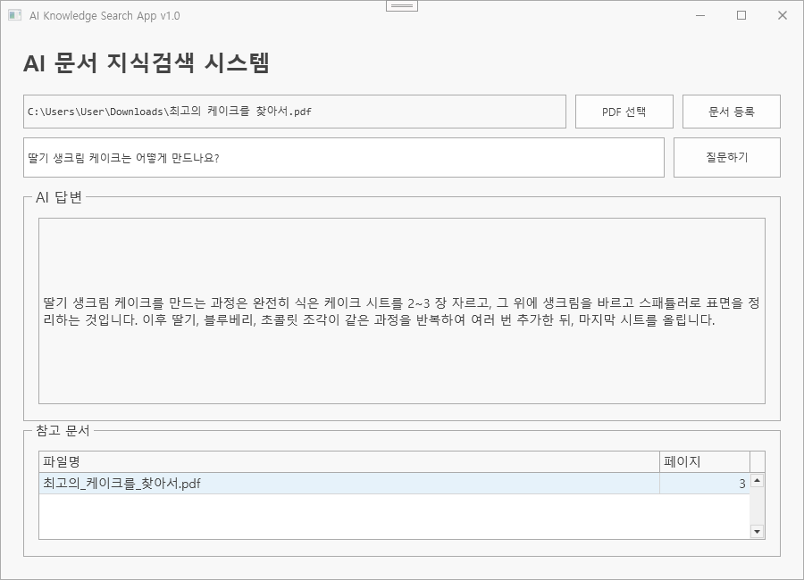

# AI Knowledge Search System

> RAG와 벡터 검색을 활용한 PDF 문서 기반 AI 지식검색·질의응답 시스템

## 실행 화면

<p align="center">
  
</p>

<br>

## 실행 영상

실행_영상_URL_추가

<br>

## 🔗 **Original Project**

> WPF 클라이언트와 FastAPI 서버 연동부터 PDF 텍스트 추출, Embedding, ChromaDB 벡터 검색, LLM 기반 답변 생성까지의 전체 구현 과정을 확인할 수 있습니다.

[View on GitHub](https://github.com/soyeong221/iot-dotnet-2026/blob/main/TOYPROJECT7.md)

---

## 프로젝트 개요

PDF 문서를 등록하고 사용자가 자연어로 질문하면 관련 내용을 검색하여 근거와 함께 답변을 제공하는 RAG 기반 AI 지식검색 시스템입니다.

C# WPF 클라이언트와 Python FastAPI 서버를 REST API로 연동하고, PDF에서 추출한 텍스트를 Chunk 단위로 분할한 뒤 Sentence Transformers를 이용해 Embedding으로 변환하여 ChromaDB에 저장했습니다.

사용자의 질문도 Embedding으로 변환해 관련 문서를 벡터 검색하고, 검색된 문맥을 Ollama 또는 OpenAI LLM에 전달하여 문서 내용을 기반으로 답변하도록 구성했습니다.

## 프로젝트 정보

| 항목        | 내용                                    |
| --------- | ------------------------------------- |
| 개발 형태     | 개인 실습 프로젝트                            |
| 클라이언트     | C#, WPF, DevExpress                   |
| 서버        | Python, FastAPI                       |
| AI / RAG  | Sentence Transformers, Ollama, OpenAI |
| 데이터 처리    | PyMuPDF, Chunking, Embedding          |
| Vector DB | ChromaDB                              |
| 통신        | REST API, JSON                        |
| 핵심 기능     | PDF 등록, 벡터 검색, 문서 기반 AI 질의응답, 출처 표시   |

## 주요 기능

* WPF 기반 PDF 등록 및 자연어 질의 UI
* WPF와 FastAPI 간 REST API 통신
* PyMuPDF 기반 PDF 텍스트 추출
* PDF 텍스트 Chunk 분할 및 Overlap 적용
* Sentence Transformers 기반 다국어 Embedding
* ChromaDB에 문서 Chunk·Embedding·Metadata 저장
* 질문 Embedding과 문서 간 유사도 기반 Vector Search
* 관련 문서의 상위 Chunk를 이용한 RAG 문맥 구성
* Ollama Local LLM 및 OpenAI 연동
* AI 답변과 참고 문서·페이지 정보 표시
* 한글 PDF 파일명 인코딩 처리
* DevExpress 기반 WPF UI 구성
* 질문 처리 중 진행 상태 표시 및 입력 제어

## 시스템 흐름

```text
PDF Upload
    ↓
WPF Client
    ↓ REST API
FastAPI Server
    ↓
PDF Text Extraction
    ↓
Chunking
    ↓
Sentence Transformer
    ↓
Embedding
    ↓
ChromaDB
```

```text
User Question
     ↓
Question Embedding
     ↓
ChromaDB Vector Search
     ↓
Relevant Document Chunks
     ↓
Ollama / OpenAI
     ↓
Answer + Source
     ↓
WPF Client
```

## 대표 트러블슈팅

### 1. Local LLM 응답 속도 개선

**문제**
Ollama Local LLM을 이용한 문서 질의에서 답변 생성 시간이 길어 사용자 대기시간이 발생했습니다.

**분석**
처리 단계별 실행 시간을 측정한 결과 벡터 검색은 약 `0.25초`, Ollama 답변 생성은 약 `16.91초`가 소요되어 LLM 답변 생성 과정이 주요 병목임을 확인했습니다.

**해결**
검색 결과를 `top_k=5`에서 `top_k=3`으로 조정하여 LLM에 전달되는 문맥을 줄이고, `think=False`, `num_predict`, `temperature`, `keep_alive` 옵션과 답변 길이를 제한하는 프롬프트를 적용했습니다.

**결과**
동일한 문서 질의에서 답변 생성 시간을 약 `16.91초 → 0.74초`로 단축했습니다.

### 2. 한글 PDF 파일명 인코딩

**문제**
WPF에서 한글 파일명의 PDF를 전송하면 인코딩된 문자열 형태로 서버에 전달되어 원래 파일명을 유지할 수 없었습니다.

**해결**
FastAPI 서버에서 전달받은 파일명을 UTF-8 기준으로 디코딩하는 로직을 추가하여 한글 파일명을 정상적으로 복원했습니다.

### 3. AI 답변 처리 상태 표시

**문제**
LLM 응답을 기다리는 동안 화면 변화가 없어 사용자가 처리 상태를 확인하기 어려웠고, 응답 완료 후에도 기존 안내 문구가 남았습니다.

**해결**
DevExpress ProgressBar를 이용해 질문 처리 중 진행 상태를 표시하고, 응답 완료 시 안내 문구 대신 실제 AI 답변으로 내용을 교체하도록 수정했습니다.

## 개선 방향

* SHA-256 해시를 활용한 동일 PDF 중복 등록 방지
* Chunk 크기와 Overlap 조정을 통한 검색 정확도 개선
* Embedding 모델 비교를 통한 검색 성능 개선
* OCR을 적용한 이미지·스캔 기반 PDF 지원

## 프로젝트 결과

* WPF와 FastAPI를 연동한 Client-Server 구조 구현
* PDF 업로드부터 Chunking·Embedding까지 문서 전처리 파이프라인 구성
* ChromaDB 기반 벡터 검색 및 RAG 질의응답 구현
* Ollama와 OpenAI LLM을 활용한 문서 기반 답변 생성
* AI 답변과 참고 문서·페이지 정보 제공
* 처리 단계별 성능 측정을 통한 LLM 병목 구간 분석
* Local LLM 답변 생성 시간 약 `16.91초 → 0.74초` 단축
* DevExpress 기반 사용자 화면 및 처리 상태 표시 개선

## 폴더 안내

* `README.md`: 프로젝트 핵심 내용
* `images/`: 실행 화면 및 시스템 구성 이미지

> 이 포트폴리오 폴더는 프로젝트를 설명하기 위한 요약본입니다. 실제 소스코드는 원본 GitHub 저장소에서 관리합니다.
