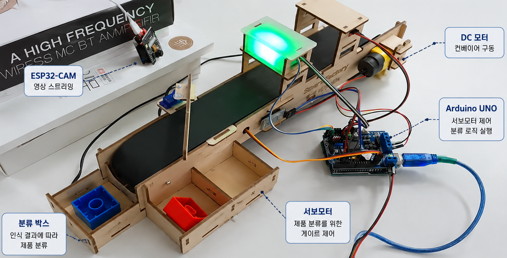
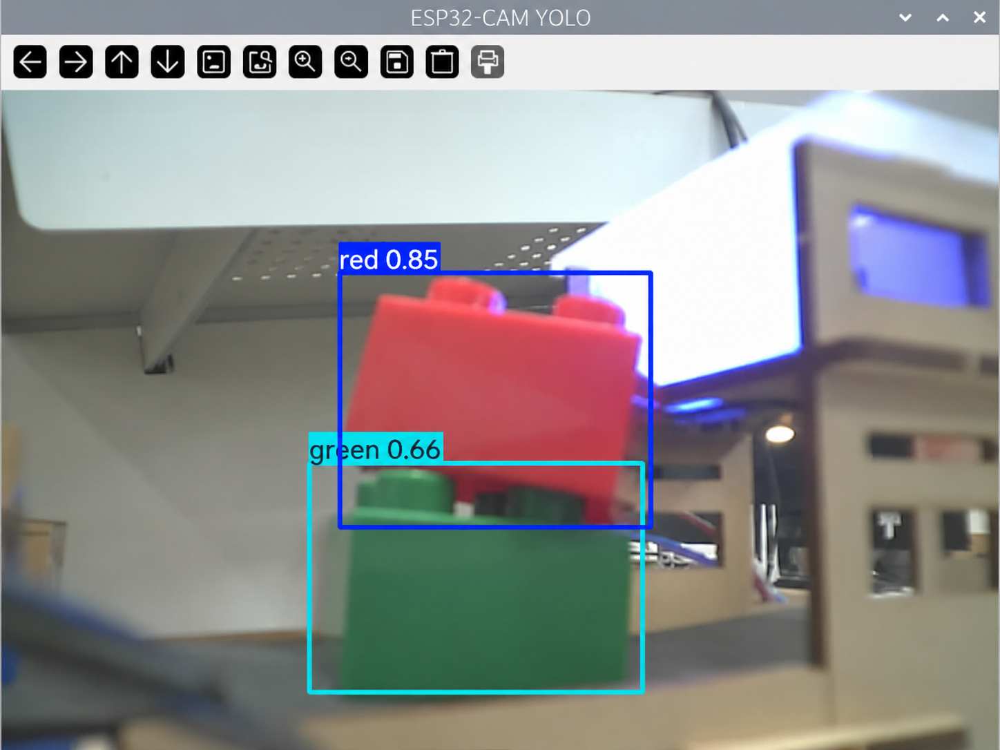
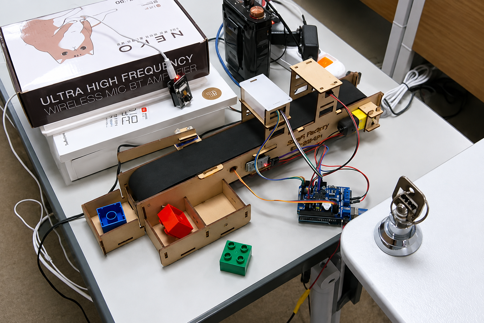
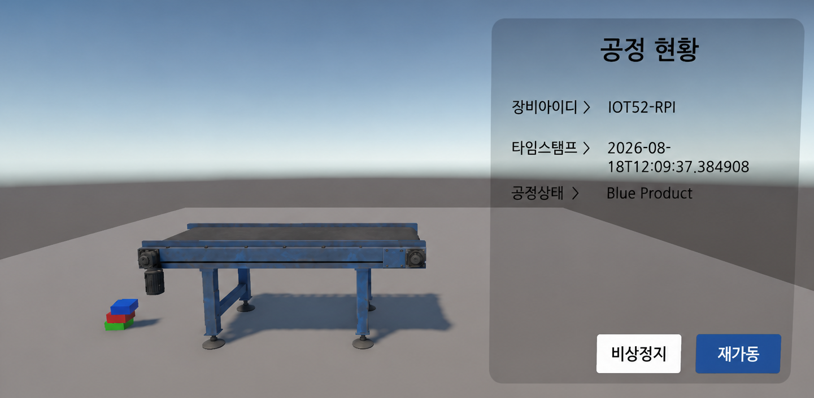

# AI Conveyor Process Control

> YOLO와 MQTT·Serial 통신을 활용한 AI 기반 컨베이어 공정관리 및 제어 시스템

## 시스템 구현

<p align="center">
  
</p>

ESP32-CAM으로 컨베이어 영상을 스트리밍하고 Raspberry Pi에서 YOLO 객체 인식을 수행한 뒤,
인식 결과를 MQTT·Serial 통신으로 전달하여 Arduino 기반 제품 분류와 컨베이어 제어까지 연동했습니다.

<br>

## 동작 결과

<table>
  <tr>
    <td align="center" width="33%">
      
      <br>
      <b>객체 인식 결과</b>
      <br>
      Red · Green · Blue 클래스 인식
    </td>
    <td align="center" width="33%">
      
      <br>
      <b>제품 분류 결과</b>
      <br>
      인식 결과에 따른 제품 자동 분류
    </td>
    <td align="center" width="33%">
      
      <br>
      <b>원격 제어 결과</b>
      <br>
      비상정지 · 재가동 및 공정 상태 확인
    </td>
  </tr>
</table>

<br>

## 실행 영상

https://github.com/user-attachments/assets/ca63ff07-7a7c-4880-b2e5-ee8844b3c621

<br>

## 🔗 **Original Project**

> ESP32-CAM 영상 스트리밍부터 YOLO 커스텀 모델 학습, Raspberry Pi 실시간 객체인식, MQTT·Serial 통신 및 Arduino 컨베이어 제어까지의 전체 구현 과정을 확인할 수 있습니다.

[View on GitHub](https://github.com/soyeong221/iot-dotnet-2026/blob/main/TOYPROJECT6.md)

---

## 프로젝트 개요

ESP32-CAM으로 컨베이어 영상을 수집하고 Raspberry Pi에서 YOLO 기반 객체인식을 수행하여 제품을 분류하는 공정관리 프로젝트입니다.

제품을 `Red`, `Green`, `Blue` 클래스로 구분하기 위한 데이터셋을 구성하고 YOLO 모델을 학습했으며,
인식 결과를 MQTT로 발행하는 동시에 Serial 통신을 통해 Arduino로 전달하도록 구성했습니다.

Arduino에서는 전달받은 제품 정보에 따라 서보모터를 제어하여 제품을 분류하고,
Unity 모니터링 화면의 MQTT 제어 메시지를 Raspberry Pi에서 수신하여
컨베이어를 원격 정지·재가동할 수 있도록 연동했습니다.

## 프로젝트 정보

| 항목 | 내용 |
|---|---|
| 개발 형태 | 교육 실습 프로젝트 |
| 핵심 기술 | Python, C/C++, YOLO, OpenCV, Raspberry Pi, ESP32-CAM, Arduino |
| 통신 | MQTT, Serial, Wi-Fi |
| 핵심 기능 | 실시간 객체인식, 제품 분류, MQTT 데이터 전송, 컨베이어 원격 제어 |

## 주요 기능

- ESP32-CAM 기반 컨베이어 영상 스트리밍
- 제품 이미지 수집 및 YOLO 커스텀 데이터셋 구성
- `Red`, `Green`, `Blue` 클래스 기반 YOLO 모델 학습
- Raspberry Pi에서 OpenCV·YOLO 기반 실시간 객체인식
- ROI를 적용한 제품 감지 영역 제한
- 객체 인식 결과와 신뢰도를 JSON 형식으로 MQTT 발행
- Raspberry Pi와 Arduino 간 Serial 통신
- 인식 결과에 따른 Arduino 서보모터 제품 분류
- Cooldown 로직을 적용한 동일 객체 중복 전송 방지
- Unity에서 MQTT를 통한 컨베이어 비상정지·재가동
- Raspberry Pi 부팅 후 프로그램 자동 실행

## 시스템 흐름

```text
ESP32-CAM
     ↓ Wi-Fi Stream
Raspberry Pi
     ↓
OpenCV + YOLO
     ↓
제품 인식 (Red / Green / Blue)
     ├──────── MQTT ────────→ Monitoring
     │
     └──────── Serial ─────→ Arduino
                                  ↓
                           Servo / Conveyor
```

```text
Unity
   ↓ MQTT
Raspberry Pi
   ↓ Serial
Arduino
   ↓
Conveyor Stop / Restart
```

## 핵심 구현 코드

### 1. YOLO 객체 인식 및 중복 전송 방지

YOLO로 검출한 객체의 중심 좌표가 ROI 내부에 있는 경우에만 처리하고,
동일 클래스가 여러 프레임에서 반복 감지될 경우 일정 시간 동안 추가 전송을 제한했습니다.

```python
center_x = (x1 + x2) // 2
center_y = (y1 + y2) // 2

if (ROI_X1 <= center_x <= ROI_X2
    and ROI_Y1 <= center_y <= ROI_Y2):

    curr_time = time.time()

    if (class_name != last_yolo_class or
        curr_time - last_yolo_time >= YOLO_SEND_INTERVAL):

        publish_yolo_data(client, class_name, confidence)

        serial_data = 'R'
        if class_name == 'red':
            serial_data = 'R'
        elif class_name == 'green':
            serial_data = 'G'
        elif class_name == 'blue':
            serial_data = 'B'

        send_to_arduino(serial_data)

        last_yolo_class = class_name
        last_yolo_time = curr_time
```

**구현 포인트**
- 객체 중심 좌표를 기준으로 ROI 내부의 제품만 처리
- 인식 클래스와 신뢰도를 MQTT로 발행
- 클래스에 따라 `R/G/B` 명령을 Serial로 Arduino에 전달
- 동일 클래스는 5초 동안 재전송을 제한하여 반복 제어 방지

[전체 Raspberry Pi 소스](https://github.com/soyeong221/iot-dotnet-2026/blob/main/toyproject/ToyProjects06/raspberrypi_part/main.py)

### 2. MQTT 원격 제어 명령을 Arduino로 전달

MQTT Control Topic으로 전달된 JSON 메시지를 Raspberry Pi에서 수신하고,
`control` 값을 추출하여 Serial 통신으로 Arduino에 전달했습니다.

```python
def on_message(client, userdata, message):
    try:
        payload = message.payload.decode('utf-8').strip()
        data = json.loads(payload)

        control = data.get('control')

        if control:
            send_to_arduino(control)

    except json.JSONDecodeError as error:
        print(f'JSON 파싱 에러 : {error}')

    except Exception as error:
        print(f'MQTT 메시지 에러 : {error}')
```

**구현 포인트**
- `CONTROL_TOPIC`을 Subscribe하여 원격 제어 메시지 수신
- JSON 메시지에서 `control` 값만 추출
- MQTT에서 받은 제어 명령을 Serial 통신으로 Arduino에 전달
- 기존 데이터 전송 구조에 장비 제어 방향을 추가하여 양방향 통신 구성

[전체 Raspberry Pi 소스](https://github.com/soyeong221/iot-dotnet-2026/blob/main/toyproject/ToyProjects06/raspberrypi_part/main.py)

### 3. Arduino 비상정지·재가동 제어

Raspberry Pi에서 전달된 Serial 명령에 따라
DC 모터와 서보모터를 제어하여 컨베이어의 비상정지와 재가동을 처리했습니다.

```cpp
if (cmd == 'T') {
    emergencyStop = true;
    analogWrite(PIN_DC_SPEED, 0);

    servo.attach(PIN_SERVO);
    servo.write(102);
    delay(500);
    servo.detach();

    Serial.print("T");
    return;
}

if (cmd == 'S') {
    emergencyStop = false;

    servo.attach(PIN_SERVO);
    servo.write(2);
    delay(500);
    servo.detach();

    analogWrite(PIN_DC_SPEED, railSpeed);
    Serial.print("S");
    return;
}
```

**구현 포인트**
- `T` 명령 수신 시 DC 모터를 정지하여 컨베이어 비상정지
- `S` 명령 수신 시 비상정지 상태를 해제하고 컨베이어 재가동
- MQTT → Raspberry Pi → Serial → Arduino로 이어지는 원격 장비 제어 구현

[전체 Arduino 소스](https://github.com/soyeong221/iot-dotnet-2026/blob/main/toyproject/ToyProjects06/arduino_part/sortingmachine.ino)

## 대표 트러블슈팅

### 1. 동일 제품의 반복 감지

**문제**  
실시간 영상의 여러 프레임에서 동일 제품이 반복 인식되어 MQTT 메시지와 Arduino 제어 명령이 여러 번 전달됨

**해결**  
제품 인식 후 일정 시간 동안 추가 전송을 제한하는 Cooldown 로직을 적용하여
중복 전송을 방지하고 서보모터 동작 시간을 확보

### 2. Raspberry Pi YOLO 실행 환경

**문제**  
Raspberry Pi 환경에서 YOLO 설치 시 PyTorch 패키지와 저장 공간 문제로 설치가 원활하지 않음

**해결**  
CPU용 PyTorch를 별도로 설치한 뒤 Ultralytics를 구성하여
Raspberry Pi 환경에서 학습 모델의 실시간 객체인식을 실행

### 3. 양방향 장비 제어

**문제**  
초기 구조에서는 컨베이어에서 생성된 데이터를 모니터링 시스템으로 전달하는 단방향 통신만 가능

**해결**  
Raspberry Pi에 MQTT Subscribe 기능을 추가하고,
수신한 제어 메시지를 Serial 데이터로 전달하여 Arduino를 제어하는 구조로 확장

## 프로젝트 결과

- 프로젝트에서 구성한 데이터셋을 활용한 YOLO 커스텀 객체인식 구현
- Raspberry Pi에서 실시간 제품 인식 및 MQTT 데이터 전송
- AI 인식 결과와 Arduino 장비 제어 연동
- MQTT와 Serial을 결합한 양방향 공정 통신 구성
- Unity에서 실제 컨베이어 비상정지·재가동 제어
- 영상 인식부터 통신·장비 제어까지 연결되는 공정 흐름 구현

> 이 포트폴리오 폴더는 프로젝트를 설명하기 위한 요약본입니다. 실제 소스코드와 상세 개발 과정은 원본 GitHub 저장소에서 관리합니다.