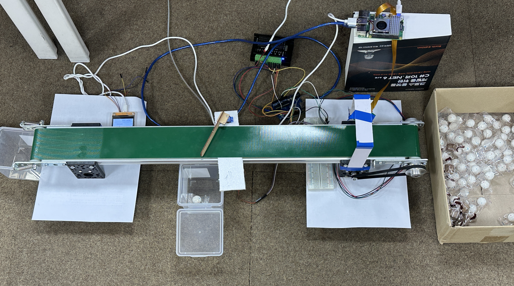
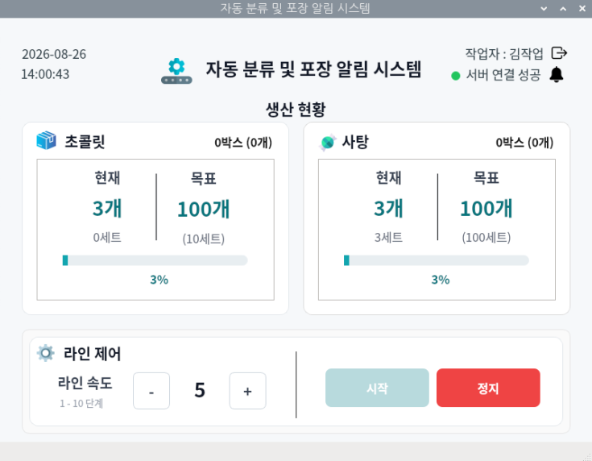
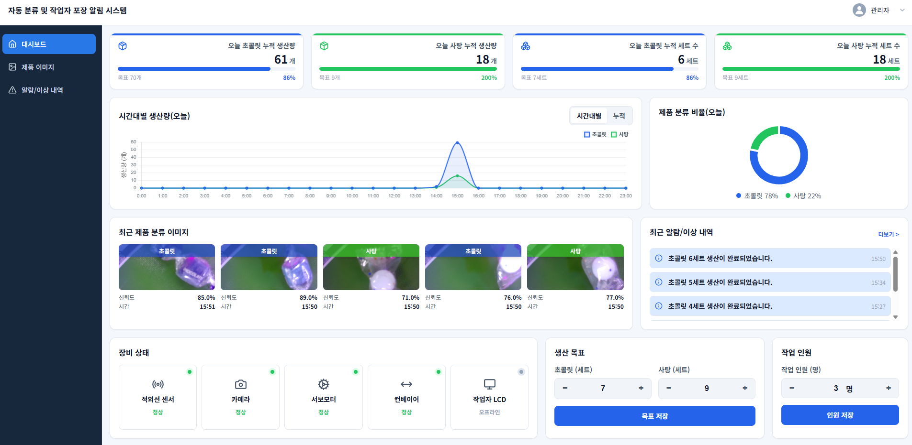
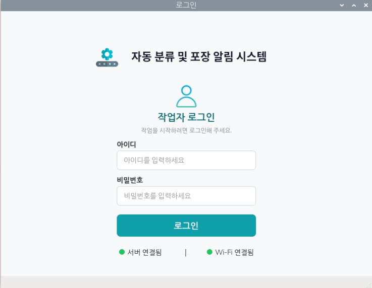
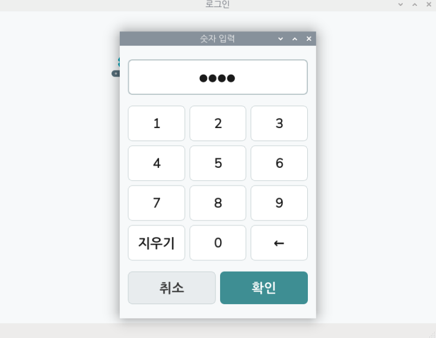
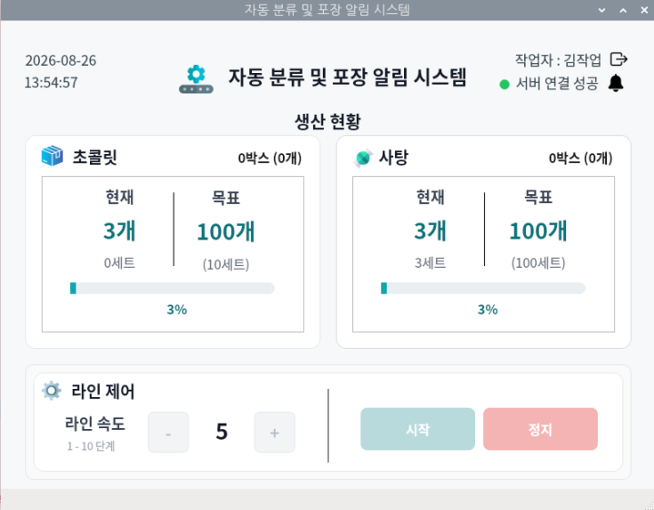
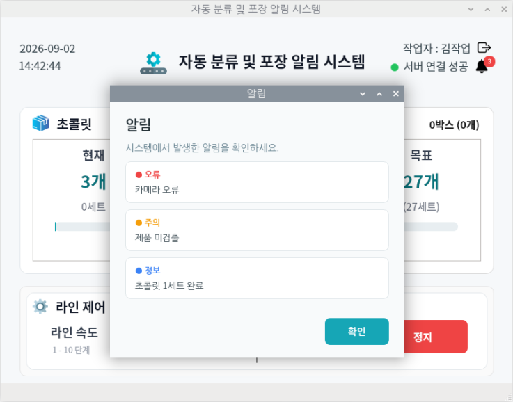
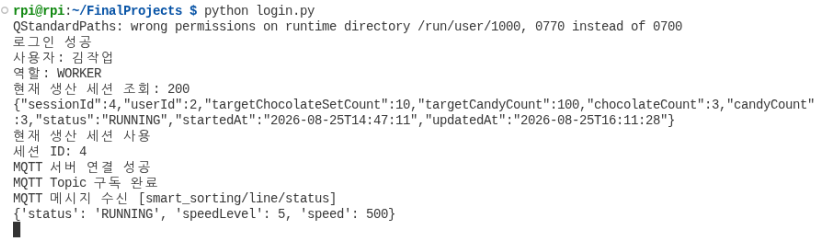
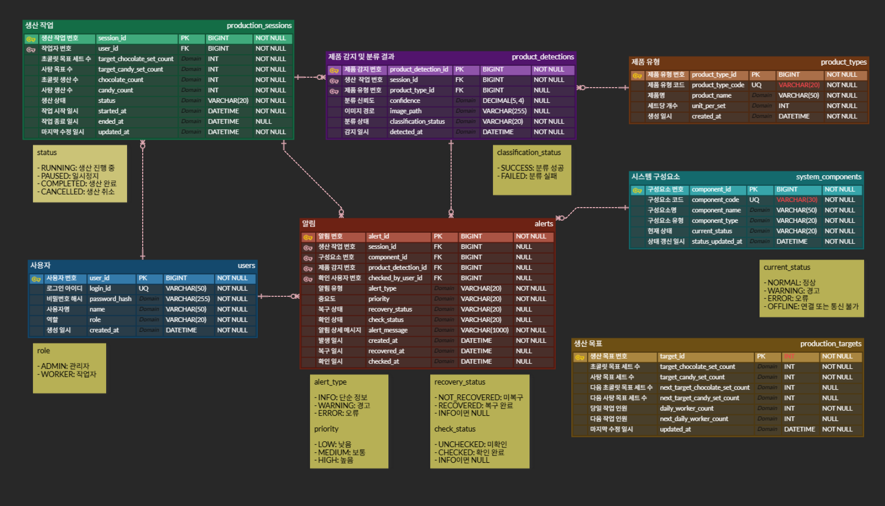

# Smart Factory Production HMI

> AI 기반 제품 분류부터 컨베이어 제어, 생산 데이터 관리 및 작업자·관리자 모니터링까지 연동한 스마트팩토리 생산관리 시스템

## 시스템 구현

<p align="center">
  
</p>

카메라와 YOLO를 이용해 컨베이어 위의 제품을 감지·분류하고, 생산 데이터를 서버와 MQTT를 통해 작업자 HMI 및 관리자 시스템과 연동했습니다.

Raspberry Pi와 Arduino 기반 제어부에서 컨베이어와 설비를 제어하며, 작업자 HMI에서는 생산현황과 라인 상태를 실시간으로 확인하고 컨베이어 시작·정지 및 속도를 제어할 수 있도록 구성했습니다.

관리자 시스템에서는 생산 데이터와 설비 상태 및 알림을 통합하여 전체 생산 공정을 모니터링할 수 있도록 구현했습니다.

<br>

## 동작 결과

### 작업자 생산관리

<p align="center">
  
</p>

<p align="center">
  <b>작업자 HMI</b><br>
  생산현황·라인 상태 확인 및 컨베이어 시작·정지·속도 제어
</p>

### 관리자 생산 모니터링

<table>
  <tr>
    <td align="center" width="50%">
      <br>
      <b>관리자 대시보드</b><br>
      생산현황 및 설비 상태 모니터링
    </td>
    <td align="center" width="50%">
      <br>
      <b>제품 감지 결과</b><br>
      감지 이미지·제품 유형·신뢰도 및 분류 결과 확인
    </td>
  </tr>
</table>

<!-- 전체 시스템 시연 영상 링크 확보 후 이 위치에 `## 실행 영상` 섹션 추가 -->

---

## 프로젝트 개요

컨베이어 공정에서 초콜릿과 사탕을 자동으로 감지·분류하고, 생산 데이터와 설비 상태를 작업자 HMI 및 관리자 Web에서 실시간으로 관리할 수 있도록 구현한 스마트팩토리 팀 프로젝트입니다.

AI 제품 분류, Raspberry Pi·Arduino 기반 현장 제어, ASP.NET Core Backend, MySQL, PyQt5 작업자 HMI 및 관리자 Web을 연동하여 하나의 생산관리 시스템으로 구성했습니다.

## 프로젝트 정보

| 항목 | 내용 |
|---|---|
| 개발 형태 | 팀 프로젝트 |
| 시스템 구성 | AI 제품 분류 · 컨베이어/설비 제어 · 작업자 HMI · 관리자 Web · Backend · Database |
| 작업자 UI | Python, PyQt5, Raspberry Pi |
| Backend | C#, ASP.NET Core, Entity Framework Core |
| 관리자 Web | HTML, CSS, JavaScript |
| AI / 영상처리 | Python, OpenCV, YOLO, Raspberry Pi Camera |
| IoT / 제어 | Raspberry Pi, Arduino, Serial |
| 통신 | MQTT, REST API, Serial |
| Database | MySQL |
| 인증 | JWT, BCrypt |
| 담당 개발 | Raspberry Pi 작업자용 PyQt5 HMI, REST API·MQTT 통신 연동 |
| 프로젝트 참여 | 요구사항 정리, DB 설계 참여, 통합 테스트, 일정·회의록 관리 |

## 주요 기능

- **AI 제품 감지·분류** — 카메라 촬영, YOLO 기반 초콜릿·사탕 분류, 이미지·분류 결과·신뢰도 연동
- **컨베이어·설비 제어** — Raspberry Pi·Arduino 기반 센서/컨베이어 제어 및 Serial 통신
- **작업자 HMI** — 로그인·생산 세션, 생산량/목표량/진행률, 설비 상태·알림, START·STOP·속도 제어
- **관리자 Web** — 생산현황, 제품 감지 결과, 설비 상태 및 알림·이상 내역 모니터링
- **Backend · Database** — ASP.NET Core REST API, MQTT 데이터 송수신, MySQL 생산·감지·설비·알림 데이터 관리

## 시스템 흐름

```text
제품 투입
   ↓
IR 센서 제품 감지
   ↓
Raspberry Pi Camera 촬영
   ↓
YOLO 제품 감지·분류
   ↓
초콜릿 / 사탕 분류 결과
   │
   ├──→ Arduino 제어 → 컨베이어 · 서보모터 동작
   │
   └──→ Backend → MySQL
                    │
              ┌─────┴─────┐
              ↓           ↓
         작업자 HMI    관리자 Web
              ↕
            MQTT
              ↕
     생산현황 · 라인상태
     설비상태 · 알림 · 제어
```

REST API는 사용자 인증과 생산 세션처럼 서버에서 관리되는 데이터를 처리하고, MQTT는 생산현황·설비 상태와 제어 명령처럼 실시간으로 주고받아야 하는 데이터를 처리하도록 역할을 구분했습니다.

## 담당 역할

팀 프로젝트에서 **Raspberry Pi 기반 작업자용 PyQt5 HMI 개발과 서버·제어부 통신 연동**을 담당했습니다.

- **작업자 HMI** — 로그인·생산현황·진행률·라인/설비 상태·알림 UI 및 컨베이어 제어
- **REST API** — 사용자 인증, 현재 생산 세션 조회·생성·종료 연동
- **MQTT** — 생산현황·라인·설비·알림 실시간 수신 및 START·STOP·SET_SPEED 명령 전송
- **프로젝트 공통 작업** — 요구사항 정리, DB 설계 참여, 통합 테스트, 일정·회의록 관리

## 작업자 HMI 구현

### 로그인 및 터치 입력

<table>
  <tr>
    <td align="center" width="50%">
      <br>
      <b>작업자 로그인</b>
    </td>
    <td align="center" width="50%">
      <br>
      <b>터치 숫자 키패드</b>
    </td>
  </tr>
</table>

- 작업자 ID·비밀번호 기반 로그인 및 JWT 인증
- 800×600 터치 디스플레이 환경에 맞춘 화면 구성
- 입력창 터치 시 숫자 전용 키패드 표시
- 로그인 후 현재 생산 세션 조회 및 신규 세션 생성

### 실시간 생산현황 및 라인 제어

<table>
  <tr>
    <td align="center" width="50%">
      <br>
      <b>라인 정지 상태</b>
    </td>
    <td align="center" width="50%">
      <br>
      <b>라인 동작 상태</b>
    </td>
  </tr>
</table>

- 초콜릿·사탕 현재 생산량, 목표량, Set 수량 및 진행률 표시
- 라인 `RUNNING`·`STOPPED` 상태에 따른 제어 버튼 활성화
- 컨베이어 START·STOP 및 1~10단계 속도 Up·Down 제어
- 제어 명령 전송 후 실제 `line/status`를 수신하여 화면 상태 동기화
- 서버 연결 상태 및 작업자 정보 표시

### 설비 상태 및 실시간 알림

<p align="center">
  
</p>

- MQTT 기반 설비 상태 및 시스템 Alert 실시간 수신
- `NORMAL`, `WARNING`, `ERROR`, `OFFLINE` 설비 상태 처리
- 오류·주의·정보 알림 목록 및 미확인 알림 Badge 표시
- `alertId` 기준 동일 Alert 중복 표시 방지
- 작업자가 빠르게 확인할 수 있도록 `shortMessage` 중심으로 표시

## 핵심 구현 코드

### 1. REST API 기반 생산 세션 연동

로그인 성공 후 JWT를 이용해 현재 생산 세션을 조회하고, 기존 세션이 있으면 해당 세션을 사용하고 세션이 없으면 신규 생산 세션을 생성하도록 구현했습니다.

```python
response = requests.get(
    f"{API_BASE_URL}/api/production-sessions/current",
    headers={"Authorization": f"Bearer {self.token}"},
    timeout=5
)

if response.status_code == 200:
    session = response.json()
    self.current_session = session
    self.session_id = session["sessionId"]
    self.open_main_window()
elif response.status_code == 404:
    self.start_production_session()
```

**구현 포인트**
- JWT를 Header에 포함하여 인증된 API 요청 처리
- 생산 세션 존재 여부에 따라 기존 세션 사용 또는 신규 세션 생성
- 로그인 → 생산 세션 → 작업자 HMI로 이어지는 작업 흐름 구성

### 2. MQTT 수신 데이터와 PyQt UI 연동

생산현황·라인 상태·설비 상태·알림 메시지를 Topic별로 구분하여 수신하고, MQTT Callback에서 PyQt Signal을 발생시켜 UI 갱신 로직으로 전달했습니다.

```python
def on_mqtt_message(self, client, userdata, msg):
    try:
        message = msg.payload.decode("utf-8")
        data = json.loads(message)

        if msg.topic == TOPIC_PRODUCTION_STATUS:
            self.production_signal.emit(data)
        elif msg.topic == TOPIC_LINE_STATUS:
            self.line_status_signal.emit(data)
        elif msg.topic == TOPIC_ALERT:
            self.alert_signal.emit(data)
        elif msg.topic == TOPIC_COMPONENT_STATUS:
            self.component_status_signal.emit(data)

    except json.JSONDecodeError:
        print(f"JSON 형식 오류 [{msg.topic}]")
    except Exception as e:
        print(f"MQTT 메시지 처리 오류 : {e}")
```

**구현 포인트**
- Topic별 실시간 데이터 분리 및 JSON Payload 파싱
- MQTT Callback과 GUI 갱신 로직 분리
- PyQt Signal을 통한 실시간 UI 반영

<p align="center">
  
</p>

<p align="center"><sub>생산현황·라인 상태·설비 상태·알림 Topic의 MQTT 통신 확인</sub></p>

### 3. MQTT 기반 컨베이어 속도 제어

작업자에게는 컨베이어 속도를 1~10단계로 제공하고, 선택한 단계를 실제 제어값으로 변환하여 MQTT 제어 명령으로 전달했습니다.

```python
def change_speed(self, delta):
    new_speed_level = self.speed_level + delta

    if new_speed_level < 1 or new_speed_level > 10:
        return

    new_speed = new_speed_level * 100

    message = {
        "command": "SET_SPEED",
        "speedLevel": new_speed_level,
        "speed": new_speed
    }

    self.publish_line_control(message)
```

**구현 포인트**
- 작업자 화면의 속도를 1~10단계로 단순화하고 실제 제어값으로 변환
- `START`, `STOP`, `SET_SPEED` 명령을 MQTT로 제어부에 전달
- 제어부의 실제 `line/status`를 다시 수신하여 HMI 상태 동기화

## 대표 트러블슈팅

### 1. 제어 명령과 실제 컨베이어 상태 불일치 방지

**문제**  
작업자 입력 직후 HMI 상태를 변경하면 MQTT 명령 전달 실패나 제어부 처리 지연 시 실제 컨베이어와 화면 상태가 달라질 수 있었습니다.

**해결**  
HMI에서는 `line/control`을 통해 제어 명령만 전달하고, 실제 화면 상태는 제어부의 `line/status`를 다시 수신한 후 갱신하도록 구성했습니다. 이를 통해 **제어부에서 확인된 실제 상태를 HMI의 기준으로 사용**했습니다.

### 2. MQTT Callback과 PyQt UI 처리 분리

**문제**  
MQTT 메시지는 비동기적으로 수신되기 때문에 Callback에서 Qt Widget을 직접 변경하면 GUI Thread와 충돌할 가능성이 있었습니다.

**해결**  
Callback에서는 Topic 구분과 JSON 파싱을 처리하고 `pyqtSignal`을 발생시켜 실제 Widget 변경은 UI 처리 함수에서 수행하도록 분리했습니다. 이를 통해 **통신 처리와 GUI 갱신 로직을 분리하여 실시간 UI 처리 안정성을 높였습니다.**

### 3. 반복 Alert의 중복 표시 방지

**문제**  
동일한 Alert가 반복 수신되면 같은 장애가 여러 번 표시되고 미확인 알림 개수가 중복 증가할 수 있었습니다.

**해결**  
수신한 `alertId`를 기존 알림과 비교하여 이미 처리한 ID는 다시 추가하지 않도록 구성하고, 작업자 화면에는 `shortMessage`를 표시하여 **동일 장애의 반복 표시를 방지하고 필요한 정보를 빠르게 확인**할 수 있도록 했습니다.

## Database 설계

생산 세션을 중심으로 작업자·생산 목표·제품 감지 결과를 연결하고, 설비 상태와 알림 이력을 관리할 수 있도록 Database 구조 설계에 참여했습니다.

<p align="center">
  
</p>

> Database 구조 및 요구사항 정리에 참여했으며, Backend와 Database 구현은 팀원이 담당했습니다.

## 프로젝트 결과

- AI 제품 분류부터 현장 제어, Backend·Database, 작업자 HMI 및 관리자 Web까지 연결된 **스마트팩토리 생산관리 시스템을 팀 프로젝트로 구현**
- PyQt5 작업자 HMI에서 REST API와 MQTT를 연동하여 **생산현황 모니터링과 실시간 설비 제어 기능 구현**
- 서버·제어부·HMI 통합 테스트를 통해 **현장 장비 → 통신 → 서버 → 사용자 화면 → 제어 명령으로 이어지는 시스템 흐름 경험**

> 팀 프로젝트에서 **Raspberry Pi 기반 PyQt5 작업자 HMI 개발 및 REST API·MQTT 통신 연동**을 담당했습니다.
